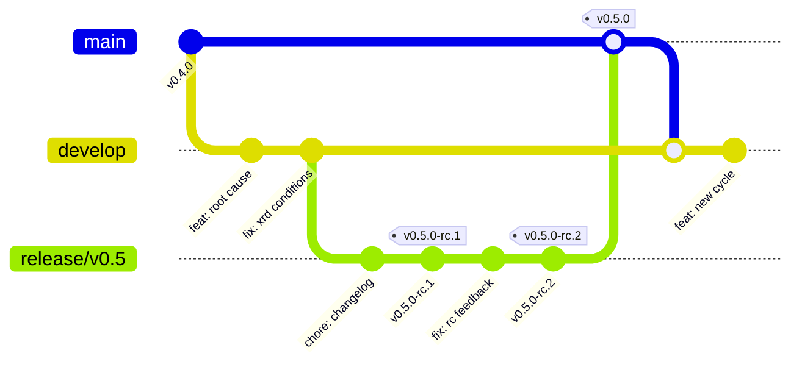

# Branching and release strategy

`main` is what people install. It is never a work in progress.

Contributions land on `develop`, are stabilised on a `release/*` branch, are
published as a release candidate, and only then reach `main`. That gives every
change a pre-release soak against real control planes before anybody upgrades
into it.

## Contents

- [Branches](#branches)
- [Where do I open my pull request?](#where-do-i-open-my-pull-request)
- [Naming topic branches](#naming-topic-branches)
- [The flow](#the-flow)
- [Hotfixes](#hotfixes)
- [Tags and versions](#tags-and-versions)
- [Protection rules](#protection-rules)
- [Frequently asked questions](#frequently-asked-questions)

## Branches

| Branch | Purpose | Who merges here | Accepts pull requests from |
| --- | --- | --- | --- |
| `main` | Released code. Every commit is a tagged release or a release merge. | Maintainers only | `release/*`, `hotfix/*` |
| `develop` | Default branch. Integration branch for all development. | Maintainers, on review | `feat/*`, `fix/*`, `docs/*`, `chore/*`, `refactor/*`, `test/*`, `perf/*`, `build/*`, `ci/*`, `deps/*` |
| `release/vX.Y` | Stabilisation for one minor release. Cut from `develop`. Carries the `-rc.N` pre-release tags. | Maintainers | `fix/*`, `docs/*` only |
| `hotfix/vX.Y.Z` | Urgent fix for a released version. Cut from `main`. | Maintainers | n/a |

`develop` is the repository's default branch, so a fork's default and a new
clone both point at the right place without anyone having to remember.



## Where do I open my pull request?

**Against `develop`.** Always, unless a maintainer has asked you otherwise.

Pull requests targeting `main` are failed automatically with a comment telling
you how to retarget, because a change that has never been on `develop` has
never been through a release candidate. You do not need to reopen anything:
GitHub lets you change the base branch of an existing pull request from
**Edit**, next to the title.

The two exceptions, both maintainer-driven:

- a `release/*` branch merging into `main` at the end of a release;
- a `hotfix/*` branch merging into `main` for a critical fix.

## Naming topic branches

`<type>/<short-description>`, with the type matching the Conventional Commits
type you will use in the pull request title:

```text
feat/provider-config-credentials
fix/xrd-established-condition
docs/vscode-client-setup
chore/bump-golangci-lint
refactor/toolset-registration
test/tree-traversal-edge-cases
perf/managed-resource-pagination
ci/windows-matrix
```

Include the issue number if it helps you: `fix/1234-xrd-established-condition`.

Keep one logical change per branch. If your branch needs the word "and" to
describe it, it is two branches.

## The flow

### Contributors

```shell
git clone https://github.com/<you>/crossplane-mcp-server.git
cd crossplane-mcp-server
git remote add upstream https://github.com/ravibagri5/crossplane-mcp-server.git

git fetch upstream
git switch -c feat/provider-config-credentials upstream/develop

# work, then
make check
git commit --signoff
git push origin feat/provider-config-credentials
```

Open the pull request against `develop`. Keep your branch current by rebasing
on `upstream/develop`, not by merging it in:

```shell
git fetch upstream
git rebase upstream/develop
git push --force-with-lease
```

Pull requests are squash-merged, so the pull request title becomes the commit
message on `develop`. Write it as a
[Conventional Commit](https://www.conventionalcommits.org/):

```text
feat(diagnostics): report ProviderConfig credential resolution
fix(resources): fall back to Established on XRDs without Ready
docs: document VS Code client configuration
feat(resources)!: rename crossplane_list_managed to crossplane_managed_resources
```

A `!` or a `BREAKING CHANGE:` footer marks a change to a tool contract. Those
force a minor bump before 1.0 and a major bump after it, and they must be
described in the pull request's breaking-changes section.

### Maintainers, cutting a release

1. Open a release checklist issue from the template.
2. Cut the branch: `git switch -c release/v0.5 develop && git push -u origin release/v0.5`.
3. Move the CHANGELOG `Unreleased` section under the new version heading, on the
   release branch.
4. Tag a candidate: `git tag -s v0.5.0-rc.1 -m "v0.5.0-rc.1" && git push origin v0.5.0-rc.1`.
   GoReleaser marks any tag with a pre-release suffix as a GitHub pre-release,
   so it never becomes "latest".
5. Soak it. Fixes go to `release/v0.5` as ordinary pull requests, then get
   cherry-picked or merged back to `develop`. No new features on a release
   branch.
6. Re-tag `-rc.N` as needed until it is quiet.
7. Merge `release/v0.5` into `main` with a merge commit, not a squash, so the
   release history is preserved.
8. Tag the release from `main`: `git tag -s v0.5.0 -m "v0.5.0" && git push origin v0.5.0`.
9. Merge `main` back into `develop` so the release branch's fixes and the
   CHANGELOG move forward.
10. Close the milestone; move anything unfinished to the next one.

## Hotfixes

For a critical bug or a security fix in a released version, do not wait for the
next `develop` cycle:

```shell
git switch -c hotfix/v0.5.1 v0.5.0
# fix, with a test
git push -u origin hotfix/v0.5.1
```

Open the pull request against `main`, tag `v0.5.1` from `main` once merged, and
then merge `main` into `develop` immediately. A hotfix that is not
forward-ported comes back as a regression in the next release.

Security fixes follow [SECURITY.md](../SECURITY.md) and are prepared privately
before the branch is pushed.

## Tags and versions

The project follows [Semantic Versioning](https://semver.org/). Before 1.0 the
tool contract is not yet frozen, so:

| Change | Pre-1.0 | Post-1.0 |
| --- | --- | --- |
| Renaming or removing a tool, or making an optional argument required | minor | major |
| Adding a tool, or an optional argument | patch or minor | minor |
| Bug fix, docs, internals | patch | patch |

Tag format:

- `vX.Y.Z` — a release, tagged on `main`.
- `vX.Y.Z-rc.N` — a release candidate, tagged on `release/vX.Y`.
- `vX.Y.Z-beta.N` — an early preview of something large, such as the first
  write tier. Also tagged on a release branch.

Tags are signed (`git tag -s`). Pre-release tags never update the `latest`
container image tag.

## Protection rules

Configured on the repository; listed here so contributors know what to expect.

**`main`**

- Pull request required; direct pushes blocked.
- Base branch restricted to `release/*` and `hotfix/*` by the branch guard
  workflow, which runs as the `Check base branch` status check.
- One approval required, plus CODEOWNERS review. Stale approvals are dismissed
  when new commits land.
- Required checks: `Check sign-off` (DCO) and `Check base branch`.
- Branches must be up to date before merging.
- Linear history and conversation resolution required; force pushes and
  deletion blocked.

**`develop`**

- Pull request required; direct pushes blocked.
- One approval required, plus CODEOWNERS review. Stale approvals are dismissed
  when new commits land.
- Required check: `Check sign-off` (DCO).
- Branches must be up to date before merging.
- Conversation resolution required; force pushes and deletion blocked.

**`release/*`**

- Same as `develop`, plus: no new features, only fixes and release preparation.

### Why CI is not a required check

CI is path-filtered: `ci.yaml` carries `paths-ignore` for `**.md` and `docs/**`,
so a documentation-only pull request skips it entirely. A skipped workflow never
reports a status, and a required check that never reports blocks the merge
button forever. Requiring CI would therefore make every docs pull request
unmergeable.

The DCO and branch guard workflows have no path filter, so they always report
and are safe to require. The DCO job explicitly succeeds for pull requests
opened by `dependabot[bot]`; human-authored pull requests still need signed-off
commits.

CI still runs and is still visible on every pull request that touches code, and
a red build is a blocker in review even though the button does not enforce it.
To make CI genuinely required, `ci.yaml` would need an aggregating job that runs
unconditionally and reports success when the path-filtered jobs are skipped.

### A note on admin bypass

`enforce_admins` is off, so maintainers can merge past these rules. That is a
deliberate concession to the project having one maintainer: GitHub does not let
anyone approve their own pull request, so a strict reading of "one approval"
would make the repository unmergeable.

Raise `required_approving_review_count` enforcement, and turn `enforce_admins`
on, once there is a second maintainer. Until then, treat the bypass as
something to be embarrassed about using, not a routine step.

## Frequently asked questions

**I opened my pull request against `main` by mistake.**
Edit the pull request, change the base branch to `develop`, and rebase if
GitHub shows conflicts. Nothing is lost.

**My change is a one-line typo. Does it still go through `develop`?**
Yes. There is no separate path for small changes; `develop` merges to `main`
often enough that it costs you nothing.

**Can I base my branch on another contributor's branch?**
Yes, but say so in the description and retarget to `develop` once theirs
merges.

**Why `develop` and not `next` or `pre-release`?**
`develop` is the Git Flow name and the one most contributors recognise on
sight. `next` is used by the Git project and the npm ecosystem, but is less
widely understood. "Pre-release" describes a *tag* state, not a branch, so
using it as a branch name would confuse it with the `-rc.N` tags.

**Why not trunk-based development on `main`?**
Because the users of this project point an AI assistant at production control
planes. A release candidate that somebody has run against a real cluster is
worth more here than a shorter path to `main`.
